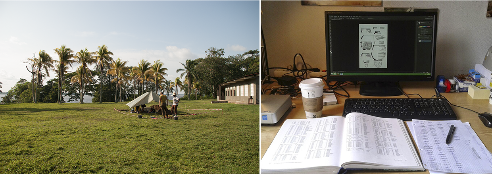

## Einleitung

#### About us

|**Dirk Seidensticker**|**Clemens Schmid**|
|------------------------------------|------------------------------------|
|seit 2015: Wiss. Mitarbeiter der Forschungsstelle Afrika (Universität zu Köln)|seit 2015: Masterstudium CAU Kiel|
|seit 2012: Promotion an der Universität zu Köln||
|**Python, R, SQL**|**R, SQL, Java, C++**|

#### Daten in der Archäologie

#### Reproduzierbarkeit

#### Vor- und Nachteile von R

|**Vorteile**|**Nachteile**|
|------------------------------------|------------------------------------|
|Reproduzierbarkeit und hohe Nachnutzbarkeit|Hohe Einstiegs-/Lernschwelle|
|Skalierbarkeit|Teilweise 'krude' Syntax|
|Erweiterbarkeit||

## Exkurs Datenniveaus

#### Daten in der Statistik

* Datentypen:
    * **ordinal skalierte Daten** haben eine festgelegte Reihenfolge
        * Ganze Zahlen und Natürliche Zahlen
        * (Boolean)
    * **nominale Daten** sind diskret und zeigen eine qualitative Ausprägung eines Merkmals

#### Skalenniveaus

