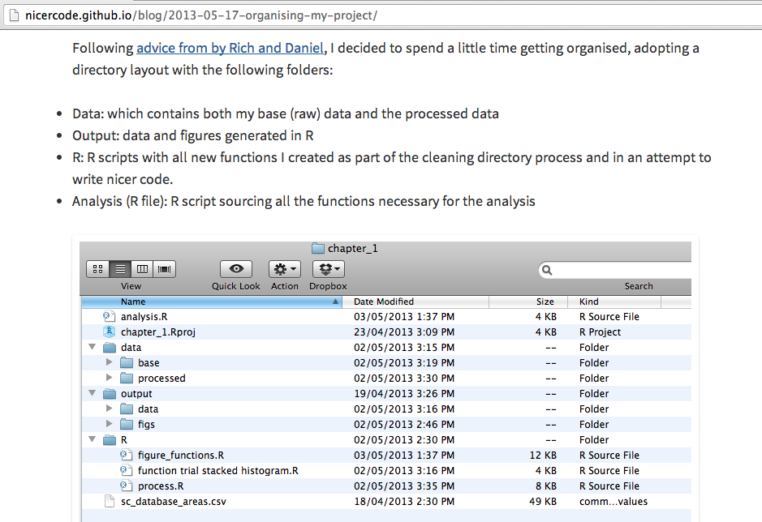

# Daten verstehen und beschreiben mit R

## Umgang mit den Daten

* Grundsätze
    * Behandle deine Roh-Daten als read-only!
    * Behandle die generierten Abbildungen so, dass du sie jederzeit löschen kannst, da sie komplett durch dein Script erstellt werden.
    * Halte Funktionen und das Skript, das sie ausführt, getrennt voneinander.

siehe http://nicercode.github.io/blog/2013-04-05-projects/

## Datenhaltung

