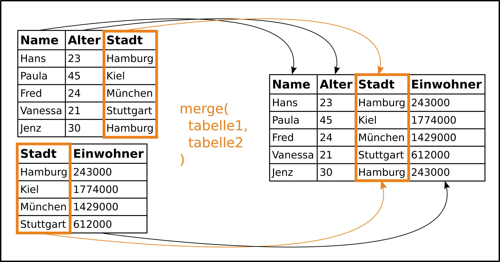
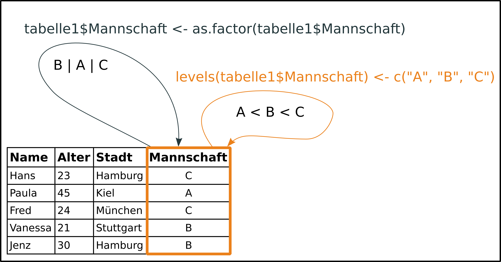
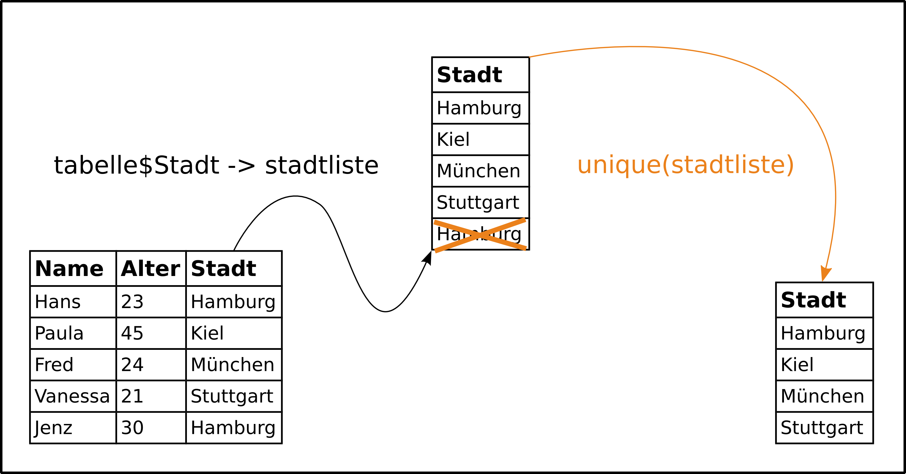
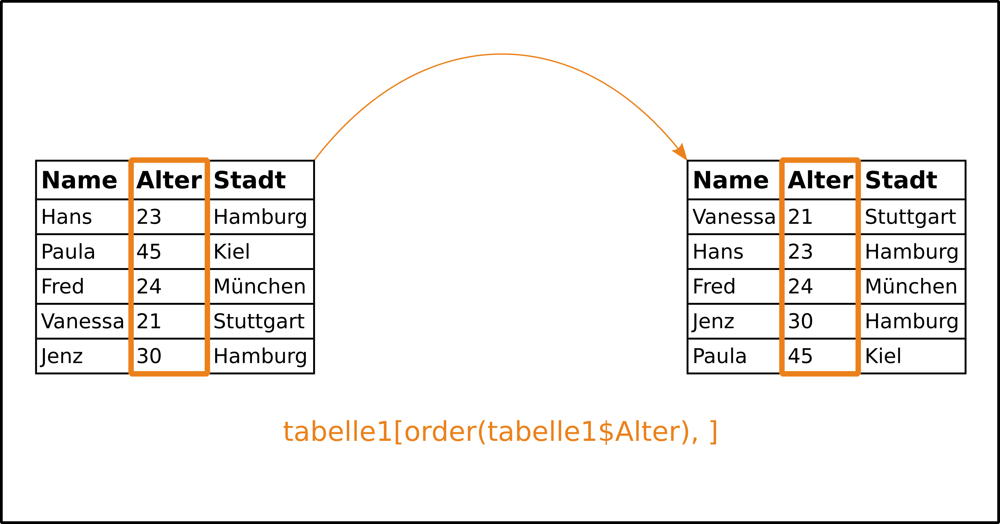
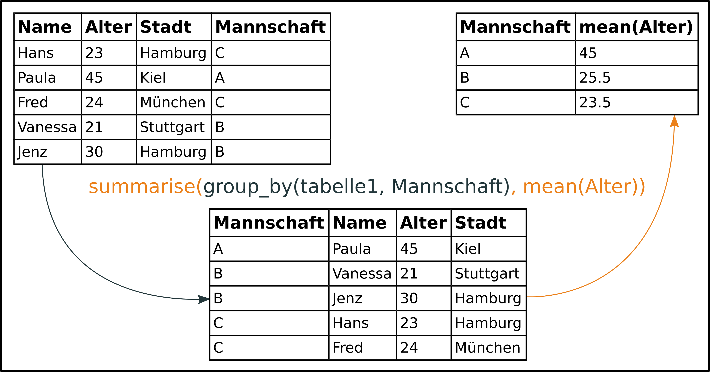

--- 
title: "Daten verarbeiten und vorbereiten" 
author: "Dirk Seidensticker/Clemens Schmid" 
date: "6. Februar 2016" 
---

# Daten verknüpfen (%in%, merge)

## Daten verknüpfen - Idee

**Zusammenführen von Informationen aus verschiedenen Tabellen.**



Vergleiche **Join-Operationen** in SQL (NATURAL JOIN, INNER JOIN, LEFT JOIN, RIGHT JOIN).  

Am Anfang steht oft die Frage, ob gemeinsame Merkmalsausprägungen vorhanden sind: **%in%** 

## base::merge()

> merge(**x**, **y**, **by** = intersect(names(x), names(y)),
      **by.x** = by, **by.y** = by, **all** = FALSE, **all.x** = all, **all.y** = all,
      sort = TRUE, suffixes = c(".x",".y"),
      incomparables = NULL, ...)

**Beschreibung**

Merge two data frames by common columns or row names, or do other versions of database join operations.

**Beispiel**

```{r} 
R <- data.frame(V1 = c(1,2,3), V2 = c(4,5,6), V3 = c("A","B","C"))
S <- data.frame(V4 = c(7,8,9), V5 = c(10,11,12), V6 = c("A","C","D"))

merge(x = R, y = S, by.x = "V3", by.y = "V6", all.x = TRUE)
```

## base::match()

> match(**x**, **table**, **nomatch** = NA_integer_, incomparables = NULL)  

> x **%in%** table

**Beschreibung**

match returns a vector of the positions of (first) matches of its first argument in its second.

%in% is a more intuitive interface as a binary operator, which returns a logical vector indicating if there is a match or not for its left operand.

**Beispiel**

```{r} 
R <- data.frame(V1 = c(1,2,3), V2 = c(4,5,6), V3 = c("A","B","C"))
S <- data.frame(V4 = c(7,8,9), V5 = c(10,11,12), V6 = c("A","C","D"))

R$V3 %in% S$V6
```

# Kategorisierung und Rangfolgen (factor & levels)

## Kategorisierung und Rangfolgen - Idee

**Werte zu Klassen zusammen fassen und Klassen in eine Rangfolgen bringen** 



Klassifizierung und die Qualität von Klassen stecken nicht direkt in Daten - sie müssen klar zugewiesen werden.  
Insbesondere für Plots von Bedeutung. 

## base::factor()

> factor(**x** = character(), **levels**, **labels** = levels,
       exclude = NA, **ordered** = is.ordered(x), nmax = NA)

**Beschreibung**

The function factor is used to encode a vector as a factor (the terms ‘category’ and ‘enumerated type’ are also used for factors). If argument ordered is TRUE, the factor levels are assumed to be ordered.

**Beispiel**

```{r} 
R <- data.frame(V1 = c(1.1,1.2,1.3), V2 = c(1,2,3))
R$V1 <- as.factor(x = R$V1)
R$V1
```

## base::levels()

> levels(**x**)

> levels(**x**) <- value

**Beschreibung**

levels provides access to the levels attribute of a variable. The first form returns the value of the levels of its argument and the second sets the attribute.

**Beispiel**

```{r} 
R <- data.frame(V1 = c(1.1,1.2,1.3), V2 = c(1,2,3))
levels(x = R$V1) <- c(1.3,1.2,1.1)
R$V1
```

# Duplikate entfernen (unique & duplicated)

## Duplikate entfernen - Idee 

**Finden und Entfernen doppelter Werte und Wertekombinationen**



Duplikate entfernen und Bandbreite einer Merkmalsausprägung erfassen: "Was gibt es überhaupt?" 

## base::unique()

> unique(**x**, incomparables = FALSE, **fromLast** = FALSE,
        nmax = NA, ...)

**Beschreibung**

unique returns a vector, data frame or array like x but with duplicate elements/rows removed.

**Beispiel**

```{r} 
R <- data.frame(V1 = c(1,1,1), V2 = c(2,2,2), V3 = c("A","A","B"))
unique(x = R)
```

## base::duplicated()

> duplicated(**x**, incomparables = FALSE,
           **fromLast** = FALSE, nmax = NA, ...)

**Beschreibung**

duplicated() determines which elements of a vector or data frame are duplicates of elements with smaller subscripts, and returns a logical vector indicating which elements (rows) are duplicates.

**Beispiel**

```{r} 
R <- data.frame(V1 = c(1,1,1), V2 = c(2,2,2), V3 = c("A","A","B"))
duplicated(x = R, fromLast = TRUE)
any(duplicated(R))
```

# Sortieren (sort & order)

## Sortieren - Idee 

**Werte und Wertekombinationen in eine Reihenfolge bringen**



Sortieren läuft für verschiedene Datentypen unterschiedlich ab: Vgl. Zahlwerte, Worte, BLOBs, etc. 

## base::sort()

> sort(**x**, **decreasing** = FALSE, na.last = NA, ...)

**Beschreibung**

Sort a vector or factor into ascending or descending order. 

**Beispiel**

```{r} 
V <- c("A","F","G","Käsebrot","B","X","Q")
sort(x = V, decreasing = TRUE)
```

## base::order()

> order(**...**, na.last = TRUE, **decreasing** = FALSE)

**Beschreibung**

order returns a permutation which rearranges its first argument into ascending or descending order, breaking ties by further arguments. 

**Beispiel**

```{r} 
R <- data.frame(V1 = c(1,1,1), V2 = c(132,78,5), V3 = c("B","A","A"))
order(R$V3, R$V2)
R[order(R$V3, R$V2), ]
```

# Gruppieren und Gruppenoperationen (aggregate & group_by & summarise)

## Gruppieren und Gruppenoperationen - Idee 

**Gruppen bilden und gruppenbezogene Fragen stellen**



Gruppen werden immer in Abhängigkeit von Merkmalsausprägungen definiert. 

Gruppenbezogene Fragen lassen nur gruppenbezogene Antworten zu - individuelle Werte gehen verloren. 

## stats::aggregate()

> aggregate(**x**, **by**, **FUN**, ..., simplify = TRUE)  

> aggregate(**formula**, **data**, **FUN**, ..., subset, na.action = na.omit)

**Beschreibung**

Splits the data into subsets, computes summary statistics for each, and returns the result in a convenient form.

**Beispiel**

```{r, warning=FALSE} 
R <- data.frame(V1 = c(3,5,1), V2 = c(3,8,5), V3 = c("B","A","A"))
aggregate(x = R, by = list(R$V3), FUN = "mean") -> a1
aggregate(V2~V3, data = R, FUN = "sum")
``` 

## dplyr::group_by()

> group_by(**.data**, **...**, add = FALSE)

**Beschreibung**

The group_by function takes an existing tbl and converts it into a grouped tbl where operations are performed "by group".

**Beispiel**
```{r, echo=FALSE, message=FALSE} 
library(dplyr)
```

```{r}
R <- data.frame(V1 = c(3,5,1), V2 = c(3,8,5), V3 = c("B","A","A"))
group_by(R, V3)
``` 

## dplyr::summarise()

> summarise(**.data**, **...**)

**Beschreibung**

Summarise multiple values to a single value.

**Beispiel**

```{r, message=FALSE} 
R <- data.frame(V1 = c(4,5,1), V2 = c(3,8,5), V3 = c("B","A","A"))
R.g <- group_by(R, V3)
summarise(R.g, Mittwelwert = mean(V1), Summe = sum(V2))
``` 

# Pivotieren (*apply & dcast)

## Pivotieren

```{r} 
atlant <- read.csv(
  "downloads/r-tut/data/AtlantData1.csv", 
  sep = "\t", 
  header = TRUE
  )
```

```{r, echo=FALSE} 
# atlant <- read.csv("C:/Users/DirkSeidenticker/Dropbox/dev/R-Tutorial_CAA20downloads/r-tut/data/AtlantData1.csv", sep = "\t", header = TRUE)
```

## Kreuztabelle mit Auszählen

```{r} 
table(atlant$site, atlant$size)
```


## Kreuztabelle mit Auszählen

*dito mit tapply*

```{r} 
a <- tapply(atlant$qty, list(atlant$site, atlant$size), length)
a[is.na(a)] <- 0
a
```


## Berechnungen in Abhängigkeit zu einer Variable

```{r} 
tapply(atlant$wt, list(atlant$site), sum)
```


## Berechnungen in Abhängigkeit zu einer Variable

```{r} 
data.frame(tapply(atlant$wt, list(atlant$site), sum))
```


## Berechnungen in Abhängigkeit zu einer Variable

```{r} 
data.frame(tapply(atlant$wt, list(atlant$site), 
                  function(x){sum(x)/1000}))
```


## Berechnungen in Abhängigkeit zu zwei Variablen ####

```{r} 
b <- data.frame(tapply(atlant$wt, 
                list(atlant$site, atlant$size), sum), 
                check.names = FALSE)
b[is.na(b)] <- 0
b
```


## Auszählen in Abhängigkeit zu drei Variablen

```{r} 
library(reshape2)

pivot <- dcast(atlant, site + feature ~ size) 

head(pivot)
```


## Berechnungen in Abhängigkeit zu drei Variablen

```{r} 
pivot2 <- dcast(atlant, site + feature ~ size, 
      value.var = "wt", 
      fun.aggregate = sum)

head(pivot2)
```

# Datenanordnung - wide to long und long to wide (melt)

## Melt
> Eingabeformat für ggplot2()!!!

Wir wollen diese vorhin erstelle Tabelle plotten:

```{r} 
a
```


## Melt

```{r} 
library(reshape2)
atlant_sites.size <- melt(a)

head(atlant_sites.size)
```


## Melt

```{r} 
colnames(atlant_sites.size) <- c('site', 'size', 'qty')

head(atlant_sites.size)
```


# Filtern (subset & filter)

## Filter und Subseting nach site 'F'

```{r} 
atlant_sub <- subset(atlant, site == 'F')
head(atlant_sub)

```


## Filter mit mehrere Bedingungen

```{r, message=FALSE} 
library(dplyr)
```

```{r} 
atlant_filter <- filter(atlant, site == 'F' & wall > 5)
head(atlant_filter)
```
